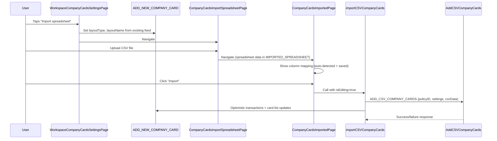

# CSV Company Card Edit and Delete Implementation

## Prerequisite: Creation PR #80636

PR [#80636](https://github.com/Expensify/App/pull/80636) (branch `mario-createCsvCompanyCards`) introduces the CSV company card creation flow. Both Edit and Delete features build on top of it. Key additions from that PR:

- **Pages**: `ImportFromFileStep.tsx`, `CompanyCardsImportSpreadsheetPage.tsx`, `CompanyCardsImportedPage.tsx`, `CompanyCardLayoutNamePage.tsx` (all in `src/pages/workspace/companyCards/addNew/`)
- **Action**: `importCSVCompanyCards()` in [CompanyCards.ts](src/libs/actions/CompanyCards.ts) with `buildOptimisticCompanyCardCSVTransactions()` helper
- **API**: `IMPORT_CSV_COMPANY_CARDS` write command with `ImportCSVCompanyCardsParams` (`policyID`, `settings`, `csvData`)
- **Routes**: `WORKSPACE_COMPANY_CARDS_IMPORT_SPREADSHEET`, `WORKSPACE_COMPANY_CARDS_IMPORTED`, `WORKSPACE_COMPANY_CARDS_LAYOUT_NAME`
- **Onyx state**: Uses `ONYXKEYS.ADD_NEW_COMPANY_CARD` to track flow state (`companyCardLayoutName`, `layoutType`, `useAdvancedFields`)

Critical detail: `importCSVCompanyCards` already handles both create and update optimistically via:

```typescript
const shouldCreateFeed = !existingCompanyCards?.[feedName];
```

---

## Part 1: Edit Company Card Feed (#85052)

### Design Doc Reference (Section 2.3)

The edit flow allows users to import additional transactions into an existing CSV feed via a new spreadsheet. The user accesses this from the feed's Settings page.

### 1.1 New API Command

**Add `ADD_CSV_COMPANY_CARDS` write command** -- the design doc specifies a separate `AddCSVCompanyCards` backend command that validates the feed exists before proceeding. The params are identical to `ImportCSVCompanyCardsParams`.

**Files to modify:**

- [src/libs/API/types.ts](src/libs/API/types.ts) -- Add `ADD_CSV_COMPANY_CARDS: 'AddCSVCompanyCards'` to `WRITE_COMMANDS` and wire up the parameter type in `WriteCommandParameters`
- Create [src/libs/API/parameters/AddCSVCompanyCardsParams.ts](src/libs/API/parameters/AddCSVCompanyCardsParams.ts) -- Same shape as `ImportCSVCompanyCardsParams` (policyID, settings, csvData)
- [src/libs/API/parameters/index.ts](src/libs/API/parameters/index.ts) -- Export the new params type

### 1.2 Action Function

**Modify `importCSVCompanyCards` or create `addCSVCompanyCards`** in [src/libs/actions/CompanyCards.ts](src/libs/actions/CompanyCards.ts).

Recommended approach: Add an optional `isEditing` flag to `ImportCSVCompanyCardsData`. When `isEditing` is true, call `WRITE_COMMANDS.ADD_CSV_COMPANY_CARDS` instead of `WRITE_COMMANDS.IMPORT_CSV_COMPANY_CARDS`. The optimistic/failure data logic remains the same since `shouldCreateFeed` already handles both cases.

```typescript
type ImportCSVCompanyCardsData = {
  // ...existing fields...
  isEditing?: boolean;
};
```

At the API call site (line ~1192 in the creation PR):

```typescript
const command = isEditing
  ? WRITE_COMMANDS.ADD_CSV_COMPANY_CARDS
  : WRITE_COMMANDS.IMPORT_CSV_COMPANY_CARDS;
API.write(command, parameters, { optimisticData, successData, failureData });
```

### 1.3 Settings Page Entry Point

**Modify [src/pages/workspace/companyCards/WorkspaceCompanyCardsSettingsPage.tsx](src/pages/workspace/companyCards/WorkspaceCompanyCardsSettingsPage.tsx):**

Add an "Import spreadsheet" menu item conditionally shown for CSV feeds, positioned above the "Remove card feed" button. Import the `Spreadsheet` icon.

Detection logic (consistent with how `WorkspaceCompanyCardsTableHeaderButtons.tsx` does it):

```typescript
const isCsvFeed = feed?.includes(CONST.COMPANY_CARD.FEED_BANK_NAME.CSV);
```

On press:

1. Set `ADD_NEW_COMPANY_CARD` Onyx data with the existing feed's `layoutType` (the feed name, e.g. `ccupload` or `ccupload_1`), `companyCardLayoutName` (from the feed's custom name), and `useAdvancedFields` (from saved template if available).
2. Navigate to `ROUTES.WORKSPACE_COMPANY_CARDS_IMPORT_SPREADSHEET.getRoute(policyID)`

Existing feed data is available via:

- `feed` (from `getCompanyCardFeed(selectedFeed)`) -- provides the feed bank name / type
- `feedName` (from `getCustomOrFormattedFeedName(...)`) -- provides the display name
- `selectedFeedData?.customFeedName` -- the raw custom name

Call `setAddNewCompanyCardStepAndData` to populate Onyx before navigating:

```typescript
setAddNewCompanyCardStepAndData({
  data: {
    layoutType: feed,
    companyCardLayoutName: selectedFeedData?.customFeedName ?? feedName ?? "",
    useAdvancedFields: false,
  },
});
```

### 1.4 Update Navigation / Back Behavior

The creation PR's `CompanyCardsImportSpreadsheetPage.tsx` hardcodes `backTo` as the "Add new card" page. For the edit flow, it should navigate back to the settings page.

**Modify `CompanyCardsImportSpreadsheetPage.tsx`:**

Read `ADD_NEW_COMPANY_CARD` from Onyx and check if `layoutType` is pre-filled (indicating edit mode):

```typescript
const [addNewCard] = useOnyx(ONYXKEYS.ADD_NEW_COMPANY_CARD);
const isEditing = !!addNewCard?.data?.layoutType;
const backTo = isEditing
  ? ROUTES.WORKSPACE_COMPANY_CARDS_SETTINGS.getRoute(policyID)
  : ROUTES.WORKSPACE_COMPANY_CARDS_ADD_NEW.getRoute(policyID);
```

**Modify `CompanyCardsImportedPage.tsx`:**

- The back button currently goes to `WORKSPACE_COMPANY_CARDS_IMPORT_SPREADSHEET`. This is fine for both flows.
- The `closeImportPageAndModal` navigates to `WORKSPACE_COMPANY_CARDS`. This is also fine for both flows.
- Need to pass `isEditing: true` when calling `importCSVCompanyCards` in edit mode:

```typescript
importCSVCompanyCards({
  // ...existing params...
  isEditing: !!prefilledLayoutType,
});
```

The `prefilledLayoutType` is already available in the page component, set from `addNewCard?.data?.layoutType`. When it's pre-filled, it means we're editing.

### 1.5 Saved Column Mappings (Pre-populate)

The design doc states: "Screen 5 shows the mapping as originally set up, but with the data coming in from the new spreadsheet."

The creation PR sends `columnMappings` as part of the `settings` JSON to the backend. When editing, we need to restore these saved mappings.

Approach:

- The backend should return saved settings as part of the feed data (stored in Domain Member NVP via `companyCards` settings). This data may already be accessible via `ONYXKEYS.COLLECTION.SHARED_NVP_PRIVATE_DOMAIN_MEMBER`.
- In `CompanyCardsImportedPage.tsx`, when editing (i.e., `prefilledLayoutType` is set), read the saved column mappings from the feed settings and apply them to the spreadsheet via `setColumnName` from `@libs/actions/ImportSpreadsheet`.
- If saved mappings are not available from the backend, rely on the auto-detection in `ImportColumn.tsx` (which matches common header names like "Card Number", "Date", "Amount", etc.).

Note: This may require investigation into how the backend stores and returns the feed template settings. If the saved mappings are not readily available in Onyx after the creation flow, this could be a follow-up improvement, with auto-detection serving as the fallback for the initial implementation.

### 1.6 Translation Keys

If any new translation keys are needed (e.g., "Import spreadsheet" menu item text on settings page), add them to [src/languages/en.ts](src/languages/en.ts) and all other language files.

The creation PR already adds `spreadsheet.importSpreadsheet` and company card CSV-specific keys. We may be able to reuse the existing `spreadsheet.importSpreadsheet` key for the settings page menu item.

### 1.7 Summary of Files to Change (Edit)

| File                                                                            | Change                                           |
| ------------------------------------------------------------------------------- | ------------------------------------------------ |
| `src/libs/API/types.ts`                                                         | Add `ADD_CSV_COMPANY_CARDS` command              |
| `src/libs/API/parameters/AddCSVCompanyCardsParams.ts`                           | New params type                                  |
| `src/libs/API/parameters/index.ts`                                              | Export new params                                |
| `src/libs/actions/CompanyCards.ts`                                              | Add `isEditing` flag, use correct API command    |
| `src/pages/workspace/companyCards/WorkspaceCompanyCardsSettingsPage.tsx`        | Add "Import spreadsheet" menu item for CSV feeds |
| `src/pages/workspace/companyCards/addNew/CompanyCardsImportSpreadsheetPage.tsx` | Conditional `backTo` for edit vs create          |
| `src/pages/workspace/companyCards/addNew/CompanyCardsImportedPage.tsx`          | Pass `isEditing` flag, handle saved mappings     |
| Language files (`en.ts`, etc.)                                                  | New keys if needed                               |

---

## Part 2: Delete Company Card Feed (#85053)

### Design Doc Reference (Section 2.4)

> **Backend Changes**: We already have a `RemoveFeed` command that is being used in ND to delete company card feeds. Currently, CSV imported cards are stored with "upload" as bank name. We'll need to update this query to use the same "upload" bank name pattern when we're deleting a CSV card feed.
>
> **Frontend Changes**: No Frontend changes will be required.

### 2.1 Current State Analysis

The delete flow is **already fully implemented** in the frontend:

- [WorkspaceCompanyCardsSettingsPage.tsx](src/pages/workspace/companyCards/WorkspaceCompanyCardsSettingsPage.tsx) has a "Remove card feed" `MenuItem` with `ConfirmModal`
- The `deleteCompanyCardFeed` handler calls `deleteWorkspaceCompanyCardFeed(policyID, domainOrWorkspaceAccountID, feed, cardIDs, feedToOpen)` from [CompanyCards.ts](src/libs/actions/CompanyCards.ts)
- `deleteWorkspaceCompanyCardFeed` uses `API.write(WRITE_COMMANDS.DELETE_COMPANY_CARD_FEED, ...)` which maps to `RemoveFeed`
- The optimistic data handling is generic -- it marks the feed and all cards with `pendingAction: DELETE` regardless of feed type

### 2.2 What Needs to Happen

The delete functionality should work end-to-end for CSV feeds once the backend `RemoveFeed` command is updated to handle the `upload`/`ccupload` bank name pattern. Since the design doc explicitly says "No Frontend changes will be required," the frontend work for this issue is:

1. **Verify the existing flow** -- Confirm that the frontend correctly passes the CSV feed's `bankName` (e.g., `ccupload` or `ccupload_1`) to the `DELETE_COMPANY_CARD_FEED` command. Based on code analysis, it does -- the `feed` variable (from `getCompanyCardFeed(selectedFeed)`) returns the feed bank name, which is passed as `bankName` to the API.
2. **Verify `domainOrWorkspaceAccountID`** -- For CSV feeds created in the creation PR, `getDomainOrWorkspaceAccountID(workspaceAccountID, selectedFeedData)` should return the `workspaceAccountID`. This is correct for workspace-scoped CSV feeds.
3. **Verify card cleanup** -- The `cardIDs` are collected from `useCardsList(selectedFeed)`. For CSV feeds, this should include all cards in the `WORKSPACE_CARDS_LIST` for that feed. Optimistic cleanup marks all with `DELETE` and the success handler sets them to `null`.
4. **Verify feed switching** -- After deletion, `feedToOpen` is calculated as the next available non-deleted feed. This is generic and works for any feed type.

### 2.3 Potential Edge Cases to Verify

- CSV feeds use `workspaceAccountID` rather than a domain-based `domainAccountID`. Ensure `getDomainOrWorkspaceAccountID` returns the correct value for CSV feeds.
- The `cardList` property inside `WorkspaceCardsList` (unassigned cards) should also be cleaned up on deletion. The current implementation uses `SET` to null on success for the entire `WORKSPACE_CARDS_LIST` key -- this covers `cardList`.

### 2.4 Tests

Add test cases in a new or existing test file (e.g., `tests/unit/CSVCardTest.ts` or within existing card tests):

- `deleteCardFeed`: Verify `deleteWorkspaceCompanyCardFeed` correctly sets optimistic pending actions, clears cards on success, and handles failure rollback for CSV feeds
- Verify the `bankName` parameter sent to the API matches the CSV feed key format

### 2.5 Summary of Files to Change (Delete)

Since the design doc says "No Frontend changes will be required," the primary deliverable is verification and testing. If any issues are discovered during verification, address them.

| File                               | Change                                       |
| ---------------------------------- | -------------------------------------------- |
| Test file(s)                       | Add CSV feed deletion tests                  |
| `src/libs/actions/CompanyCards.ts` | Only if issues are found during verification |

---

## Flow Diagrams

### Edit Flow



### Delete Flow (Already Implemented)

```mermaid
sequenceDiagram
    participant User
    participant SettingsPage as WorkspaceCompanyCardsSettingsPage
    participant Action as deleteWorkspaceCompanyCardFeed
    participant API as RemoveFeed

    User->>SettingsPage: Taps "Remove card feed"
    SettingsPage->>SettingsPage: Show ConfirmModal
    User->>SettingsPage: Confirms deletion
    SettingsPage->>Action: deleteWorkspaceCompanyCardFeed(policyID, accountID, feed, cardIDs)
    Action->>API: DELETE_COMPANY_CARD_FEED (domainAccountID, policyID, bankName)
    Action->>Action: Optimistic: mark feed + cards as DELETE
    API-->>Action: Success: remove cards from Onyx; Failure: rollback
```
