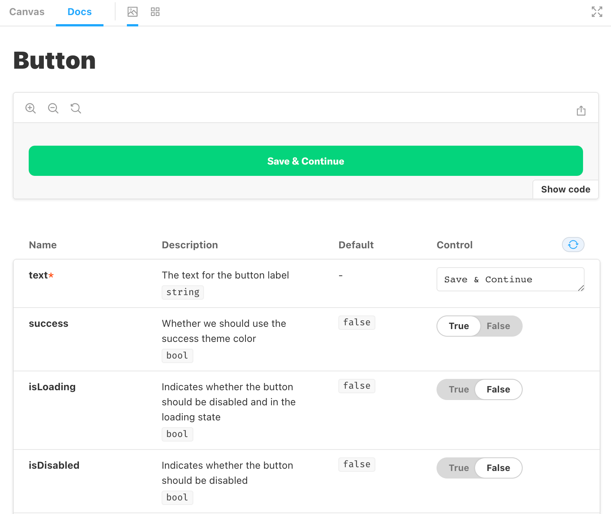

## Storybook

>Storybook is an open source tool for building UI components and pages in isolation. It streamlines UI development, testing, and documentation.

At Expensify, we primarily use [Storybook](https://storybook.js.org/) to provide interactive documentation of our design system. This helps bridge the gap between design and engineering to encourage code reusibility and improve communication.

### Building and Deploying Storybook

The Storybook docs deploy automatically so there's nothing extra to do here. Storybook is built to the `/dist` folder and lives at [`https://expensify.cash/docs/index.html`](https://expensify.cash/docs/index.html).

To test a local build we can run

```
npm run storybook-build
```

This will create a `/docs` directory in `/dist` with the static site.

### Local Testing

To skip building and load Storybook on a local server run:

```
npm run storybook
```

### What's a "story" and how do I create one?

>A story captures the rendered state of a UI component. Developers write multiple stories per component that describe all the “interesting” states a component can support.

All of our stories are located in a single directory `/src/stories`.

To create a new story for a component that does not yet have one it's a good idea to copy an existing story file and then update the relevant details. We are using the [Component Story Format](https://storybook.js.org/docs/react/writing-stories/introduction#component-story-format) to write our stories.

Here's an example story:

```javascript
import React from 'react';
import Button from '../components/Button';

export default {
	// Title field will determine how the story displays in the sidebar
    title: 'Components/Button',
    component: Button,
};

// Optional `args` are passed which determine the props the example component will have
const Template = args => <Button {...args} />;

// Each story must be exported with a named export
export const Default = Template.bind({});
Default.args = {
    text: 'Save & Continue',
    success: true,
};
```

That will give us an interactive playground to test out various component attributes with the defaults we passed.



Note that we did not need to write any of the descriptions for these props. This is because they are automatically generated from a React component's `propTypes`.

### Does it work on React Native?

Not yet, but PRs are welcome!