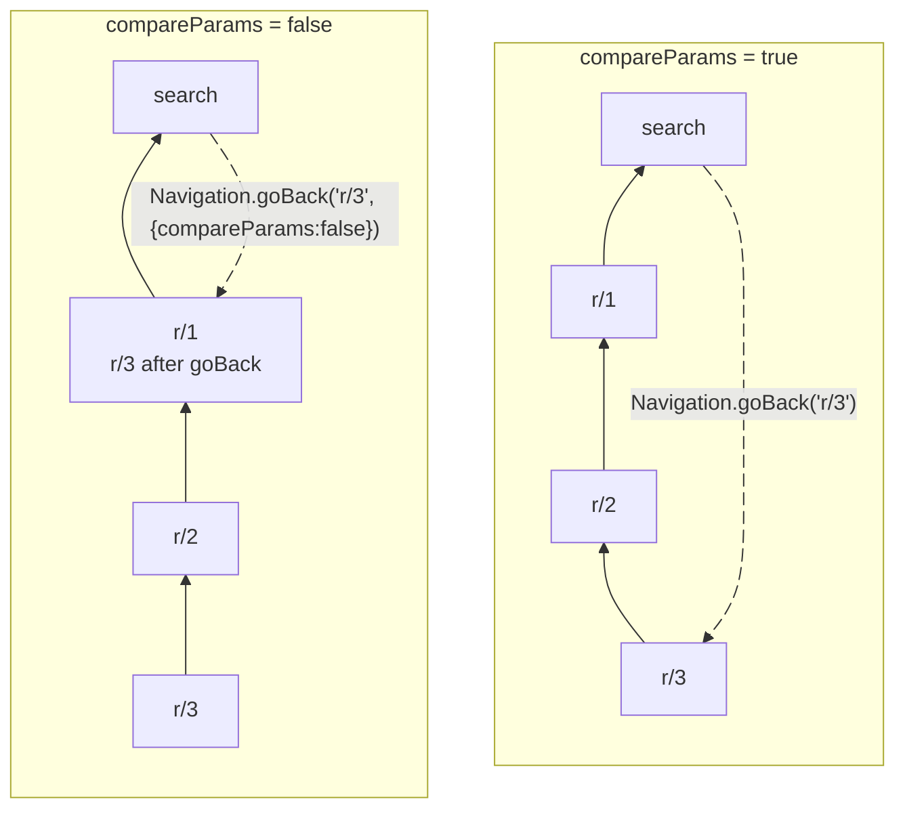

## Navigation

The navigation in the app is built on top of the `react-navigation` library. To meet all cross-platform requirements and challenges, multiple custom navigators and features were implemented. The following documentation will help you understand how to effectively use them to create new screens and navigate within the application.

### Table of contents


- [Guides](#guides)
  - [Moving between screens](#moving-between-screens)
    - [Navigating to a new screen](#navigating-to-a-new-screen)
    - [Going back](#going-back)
    - [Dismissing modals](#dismissing-modals)
    - [Dismissing modals with opening a report](#dismissing-modals-with-opening-a-report)
    - [Summary](#summary)
  - [Adding new screens](#adding-new-screens)
  - [Multi-step flows with URL synchronization](#multi-step-flows-with-url-synchronization)
    - [When to use](#when-to-use)
    - [Implementation pattern](#implementation-pattern)
  - [Debugging](#debugging)
    - [Reading state when it changes](#reading-state-when-it-changes)
    - [Finding the code that calls the navigation function](#finding-the-code-that-calls-the-navigation-function)
  - [How to remove backTo from URL](#how-to-remove-backto-from-url)
    - [Separating routes for each screen instance](#separating-routes-for-each-screen-instance)
  - [Generating state from a path](#generating-state-from-a-path)
  - [Setting the correct screen underneath RHP](#setting-the-correct-screen-underneath-rhp)
  - [Performance solutions](#performance-solutions)
  - [State persistence after page refresh](#state-persistence-after-page-refresh)
    - [How it works](#how-it-works)
    - [Saving last visited paths to session storage](#saving-last-visited-paths-to-session-storage)
    - [Navigating to Accounts](#navigating-to-accounts)
    - [Navigating to workspaces tab](#navigating-to-workspaces-tab)
- [Custom navigators](#custom-navigators)
  - [RootStackNavigator](#rootstacknavigator)
  - [FullscreenNavigator / SplitNavigator](#fullscreennavigator--splitnavigator)
    - [When do we need to adapt the split navigator state? (function `adaptStateIfNecessary`)](#when-do-we-need-to-adapt-the-split-navigator-state-function-adaptstateifnecessary)
    - [`NAVIGATORS.SEARCH_FULLSCREEN_NAVIGATOR` (Reports tab)](#navigatorssearch_fullscreen_navigator-reports-tab)
    - [`NAVIGATORS.REPORTS_SPLIT_NAVIGATOR` (Inbox tab)](#navigatorsreports_split_navigator-inbox-tab)
    - [`NAVIGATORS.SETTINGS_SPLIT_NAVIGATOR` (Account tab)](#navigatorssettings_split_navigator-account-tab)
    - [`NAVIGATORS.WORKSPACE_SPLIT_NAVIGATOR` (Workspaces tab)](#navigatorsworkspace_split_navigator-workspaces-tab)
  - [Modals](#modals)
    - [`NAVIGATORS.RIGHT_MODAL_NAVIGATOR` (RHP - Right Hand Panel)](#navigatorsright_modal_navigator-rhp---right-hand-panel)
    - [`NAVIGATORS.ONBOARDING_MODAL_NAVIGATOR`](#navigatorsonboarding_modal_navigator)
- [API Reference](#api-reference)
  - [`Navigation.navigate`](#navigationnavigate)
  - [`Navigation.goBack`](#navigationgoback)
  - [`Navigation.dismissModal`](#navigationdismissmodal)
  - [`Navigation.dismissModalWithReport`](#navigationdismissmodalwithreport)
  - [`Navigation.popToSidebar`](#navigationpoptosidebar)
  - [`useRootNavigationState`](#userootnavigationstate)

# Guides

## Moving between screens

This section describes the most common cases of moving between screens. Detailed descriptions of the functions and their parameters can be found in the [API Reference](#api-reference) section.

### Navigating to a new screen

`Navigation.navigate` is used to go to a specific screen in the app or replace an existing one. This function works based on an extended implementation of the `linkTo` method. Because of this, there are some differences between using our function and the original `navigate` returned from `useNavigation` hook.

```ts
import interceptAnonymousUser from '@libs/interceptAnonymousUser';
import Navigation from '@libs/Navigation/Navigation';
import ROUTES from '@src/ROUTES';

// Basic navigation to a route
Navigation.navigate(ROUTES.INBOX);

// Navigation with parameters
Navigation.navigate(
    ROUTES.SEARCH_ROOT.getRoute({
        query: 'type:expense search',
        // additional parameters...
    }),
);

// Navigation with forceReplace - replaces current screen instead of pushing a new one
Navigation.navigate(ROUTES.SETTINGS_WALLET, {forceReplace: true});

// Navigation with a callback to handle anonymous users
interceptAnonymousUser(() => {
    Navigation.navigate(ROUTES.SETTINGS);
});
```

> [!NOTE]
> The most relevant differences between our implementation of `Navigation.navigate` and `navigate` returned from `useNavigation`:
>
> 1. We pass `route` instead of a screen name because our implementation of `Navigation.navigate` is based on the `linkTo` method, which accepts `route` as a parameter.
> 2. We import the Navigation object from `@libs/Navigation/Navigation`, instead of getting it from the hook.
> 3. Our method uses `PUSH` instead of `NAVIGATE` by default!
> 4. We do not have a separate function `REPLACE`. To use this method, you need to pass the `forceReplace` option to `Navigation.navigate`.

### Going back

To navigate back, we use the `Navigation.goBack` function. We can call this function without any parameters, but the most common case is to call it with `backToRoute`. It is worth remembering that it is possible to deep link to any page in the application. When we open a specific page using a link, the navigation state is rebuilt and we lose previously visited pages. In such a case, we can simply use the mentioned parameter to indicate which page should be opened when going back.

If we specify a page as `backToRoute` that is not present in the navigation state, the current page will be replaced with the given one.

```ts
import Navigation from '@libs/Navigation/Navigation';
import ROUTES from '@src/ROUTES';

// goBack with a specific route - goes back to a specific screen
Navigation.goBack(ROUTES.WORKSPACES_LIST.route);

// goBack with parameters - goes back to a specific screen with parameters
const policyID = 1;
Navigation.goBack(ROUTES.WORKSPACE_OVERVIEW.getRoute(policyID));

// Simple goBack - goes back to the previous screen
Navigation.goBack();
```

> [!NOTE]
> This function should be used mainly with the `backToRoute` param. If you want to use it, make sure there is a screen to which you should always go back in a given case and pass its route as a param.

It also allows dynamic setting of `backToRoute` which is pretty handy when RHP can be opened from multiple pages. Then we should set `backTo` parameter in the URL, so it is possible to go to the previous page even after refreshing! 

> [!WARNING]
> **Deprecated**: The `backTo` parameter is deprecated and should not be used in new implementations. Most problems that `backTo` solved can be resolved by adding one or more routes for a single screen. If you don't know how to solve your problem, contact someone from the navigation team.

More information on how to use backTo route param can be found [here](#how-to-use-backto-route-param).

```ts
// src/pages/NewSettingsScreen.tsx
import HeaderWithBackButton from '@components/HeaderWithBackButton';
import ScreenWrapper from '@components/ScreenWrapper';
import Navigation from '@libs/Navigation/Navigation';
import type {PlatformStackScreenProps} from '@libs/Navigation/PlatformStackNavigation/types';
import type {SettingsSplitNavigatorParamList} from '@libs/Navigation/types';
import ROUTES from '@src/ROUTES';

type NewSettingsScreenNavigationProps = PlatformStackScreenProps<SettingsSplitNavigatorParamList, typeof SCREENS.SETTINGS.NEW_SCREEN_WITH_BACK_TO>;

const DEFAULT_ROUTE_TO_GO_BACK = ROUTES.SETTINGS;

function NewSettingsScreen({route}: NewSettingsScreenNavigationProps) {
    // Your screen component code here

    return (
        <ScreenWrapper>
            <HeaderWithBackButton onBackButtonPress={() => Navigation.goBack(route.params?.backTo ?? DEFAULT_ROUTE_TO_GO_BACK)} />
            {/* Your screen content */}
        </ScreenWrapper>
    );
}
```

In many cases, routes have parameters defined in the URL that can have different values ​​(for example `ROUTES.REPORT_WITH_ID`: `/r/123`, `/r/234` etc.).

If we have several such pages in the navigation state and we want to return to the first one regardless of its parameter values, we can use the `compareParams` option with the value set to `false` and pass it to `Navigation.goBack`.

```ts
import Navigation from '@libs/Navigation/Navigation';
import ROUTES from '@src/ROUTES';

Navigation.goBack(ROUTES.REPORT_WITH_ID.getRoute('1'), {compareParams: false});
```

Let's consider the case when we have 4 routes on stack, 3 reports with different ids and search on the top. The diagram shows how navigating back works with and without parameter comparison.



### Dismissing modals

Many flows in the application are displayed in modals. One such example is RightModalNavigator (RHP) - the most commonly used modal in Expensify. This method is used to close it along with all open pages.

```ts
import Navigation from '@libs/Navigation/Navigation';

// Simple modal dismissal
Navigation.dismissModal();
```

> [!NOTE]
> Why do we need a method other than `Navigation.goBack` to close modals?
> Let's consider the following case:
> You are going through a flow which has multiple steps. During this flow, you want to close the entire modal, no matter which page you are on. If it was the first screen in this flow, there would be no difference between `Navigation.dismissModal` and `Navigation.goBack`. But after opening several pages in RHP, if you want to close the modal, it is necessary to pop the entire RHP with all the open screens from the navigation state. This is exactly what `Navigation.dismissModal` does.

### Dismissing modals with opening a report

This happens, for example, after creating a new expense. In this case, you need to close the modal and then go to the report. So, as you might expect, you need to call `Navigation.dismissModal` and then `Navigation.navigate` to the report. Even just `Navigation.navigate` is sufficient if you do not want close the modal and be able to go back to it. And that is basically true, but there are a few additional aspects we need to pay attention to and they are covered in `dismissModalWithReport`.

```ts
import Navigation from '@libs/Navigation/Navigation';

// Dismiss modal with a report only by id
Navigation.dismissModalWithReport({
    reportID: '123',
});

// Dismiss modal with a report by id and other optional params
Navigation.dismissModalWithReport({
    reportID: '123',
    reportActionID: '123',
    referrer: `notification`,
    moneyRequestReportActionID: `123`,
    transactionID: `123`,
    backTo: `r/321`,
});
```

> [!NOTE]
> Why do we need a separate method to open a report from a modal?
>
> 1. On a narrow screen, we do not want to perform two operations: closing the modal and opening the report. This would cause two actions to be displayed on the screen, which could be confusing for users. Instead of two operations, we perform a replace on the modal, thanks to which there is a smooth transition to the report with simultaneous closing of the modal.
> 2. On a wide screen, we need to be sure that the modal has been closed before we want to navigate to the report. For this purpose, `navigate` called after `dismissModal` is wrapped in `InteractionManager.runAfterInteractions`.

### Summary

-   `Navigation.navigate` is used to navigate between screens. Remember that it calls the `linkTo` method implemented by us. It accepts the route as a parameter not a screen name.
-   `Navigation.goBack` allows you to navigate back to the previous page. You will probably need to pass the `backToRoute` parameter to this method in such cases to preserve the screen order after refreshing the page.
-   If you want to go back to the screen regardless of its parameter values, pass `{compareParams: false}` to `Navigation.goBack`.
-   If you want to close the entire modal window, regardless of how many pages you have opened, use `Navigation.dismissModal` to do that.
-   If you want to open a report from RHP to prevent navigation back to this modal window, use `Navigation.dismissModalWithReport`.

## Adding new screens

To add a new screen you need to:

1. Define constants for screen name and route:

    1. Screen name should be defined in `src/SCREENS.ts`. Find the appropriate place where the new screen name should be added based on where the new screen will be displayed.

    Let's assume we add a new screen to the Account tab.

    ```ts
    // In src/SCREENS.ts
    const SCREENS = {
        // ... existing screens ...
        SETTINGS: {
            // ...
            NEW_SCREEN: 'SETTINGS_NEW_SCREEN',
        },
    } as const;
    ```

    2. Add a new route to `src/ROUTES.ts`.

    ```ts
    // In src/ROUTES.ts
    const ROUTES = {
        // ... existing routes ...
        NEW_SETTINGS_SCREEN: 'new-settings-screen',
        // OR for a dynamic route:
        NEW_SETTINGS_SCREEN_DYNAMIC: {
            route: 'new-settings-screen/:id',
            getRoute: (id: string) => `new-settings-screen/${id}` as const,
        },
    } as const;
    ```

2. Link the screen name to the route in `src/libs/Navigation/linkingConfig/config.ts`.

```ts
const config: LinkingOptions<RootNavigatorParamList>['config'] = {
    screens: {
        [NAVIGATORS.SETTINGS_SPLIT_NAVIGATOR]: {
            screens: {
                [SCREENS.SETTINGS.NEW_SCREEN]: {
                    path: ROUTES.NEW_SETTINGS_SCREEN,
                    exact: true,
                },
                // OR for a dynamic route:
                [SCREENS.SETTINGS.NEW_SCREEN]: {
                    path: ROUTES.NEW_SETTINGS_SCREEN_DYNAMIC.route,
                },
            },
        },
    },
};
```

3. Define types for a new screen in `src/libs/Navigation/types.ts`.

```ts
type SettingsSplitNavigatorParamList = {
    ...existing types
    // static (this URL always looks the same, it does not have parameters that take different values)
    [SCREENS.SETTINGS.NEW_SCREEN]: undefined;
    // dynamic (this URL can take different values ​​of the id parameter associated with this screen - this is its dynamic part)
    [SCREENS.SETTINGS.NEW_SCREEN]: {id: number};
};
```

4. Create a new screen component and type props using the newly defined type from the previous step. The new screen component should be placed in the `src/pages` directory.

```ts
// src/pages/NewSettingsScreen.tsx
import ScreenWrapper from '@components/ScreenWrapper';
import type {PlatformStackScreenProps} from '@libs/Navigation/PlatformStackNavigation/types';
import type {SettingsSplitNavigatorParamList} from '@libs/Navigation/types';

type NewSettingsScreenNavigationProps = PlatformStackScreenProps<SettingsSplitNavigatorParamList, typeof SCREENS.SETTINGS.NEW_SCREEN>;

function NewSettingsScreen({route}: NewSettingsScreenNavigationProps) {
    // Your screen component code here
    return <ScreenWrapper>{/* Your screen content */}</ScreenWrapper>;
}

export default NewSettingsScreen;
```

5. Link the component to the screen. To do that you need to find a proper navigator:

    - If you add a central screen, you will probably want to add it to one of the full-screen navigators (SettingsSplitNavigator, SearchFullScreenNavigator, etc.).

    ```ts
    // src/libs/Navigation/AppNavigator/Navigators/SettingsSplitNavigator.tsx
    type Screens = Partial<Record<keyof SettingsSplitNavigatorParamList, () => React.ComponentType>>;

    const CENTRAL_PANE_SETTINGS_SCREENS = {
        // other account tab screens...
        [SCREENS.SETTINGS.NEW_SCREEN]: () => require<ReactComponentModule>('../../../../pages/NewSettingsScreen').default,
    } satisfies Screens;

    const Split = createSplitNavigator<SettingsSplitNavigatorParamList>();

    function SettingsSplitNavigator() {
        const route = useRoute();
        const splitNavigatorScreenOptions = useSplitNavigatorScreenOptions();

        return (
            <FocusTrapForScreens>
                <Split.Navigator
                    persistentScreens={[SCREENS.SETTINGS.ROOT]}
                    sidebarScreen={SCREENS.SETTINGS.ROOT}
                    defaultCentralScreen={SCREENS.SETTINGS.PROFILE.ROOT}
                    parentRoute={route}
                    screenOptions={splitNavigatorScreenOptions.centralScreen}
                >
                    <Split.Screen
                        name={SCREENS.SETTINGS.ROOT}
                        getComponent={loadInitialSettingsPage}
                        options={splitNavigatorScreenOptions.sidebarScreen}
                    />
                    {Object.entries(CENTRAL_PANE_SETTINGS_SCREENS).map(([screenName, componentGetter]) => {
                        return (
                            <Split.Screen
                                key={screenName}
                                name={screenName as keyof Screens}
                                getComponent={componentGetter}
                            />
                        );
                    })}
                </Split.Navigator>
            </FocusTrapForScreens>
        );
    }

    SettingsSplitNavigator.displayName = 'SettingsSplitNavigator';

    export {CENTRAL_PANE_SETTINGS_SCREENS};
    export default SettingsSplitNavigator;
    ```

    - If you add an RHP screen, you will need to put it to the right navigator in the ModalStackNavigators. In this case, you also need to ensure that the appropriate screen is displayed under the overlay. To cover it, add your screen to a proper mapping file in `src/libs/Navigation/linkingConfig/RELATIONS/index.ts`.

    ```ts
    // src/libs/Navigation/AppNavigator/ModalStackNavigators/index.tsx
    import createPlatformStackNavigator from '@libs/Navigation/PlatformStackNavigation/createPlatformStackNavigator';
    import type {PlatformStackNavigationOptions} from '@libs/Navigation/PlatformStackNavigation/types';
    import type {SettingsNavigatorParamList} from '@navigation/types';
    import SCREENS from '@src/SCREENS';
    import type ReactComponentModule from '@src/types/utils/ReactComponentModule';

    const SettingsModalStackNavigator = createModalStackNavigator<SettingsNavigatorParamList>({
        // ...existing code
        [SCREENS.SETTINGS.NEW_SCREEN]: () => require<ReactComponentModule>('../../../../pages/NewSettingsScreen').default,
    });
    ```

   Let's assume that we want to have PreferencesPage below our new Settings RHP screen.

    ```ts
    // src/libs/Navigation/linkingConfig/RELATIONS/SETTINGS_TO_RHP.ts
    import type {SettingsSplitNavigatorParamList} from '@libs/Navigation/types';
    import SCREENS from '@src/SCREENS';

    // This file is used to define relation between settings split navigator's central screens and RHP screens.
    const SETTINGS_TO_RHP: Partial<Record<keyof SettingsSplitNavigatorParamList, string[]>> = {
        // ...existing code
        [SCREENS.SETTINGS.PREFERENCES.ROOT]: [
            // ...existing code
            SCREENS.SETTINGS.NEW_SCREEN,
        ],
    };

    export default SETTINGS_TO_RHP;
    ```

## Multi-step flows with URL synchronization

Multi-step flows (wizards, forms with multiple screens) should use URL-based navigation via the `useSubPage` hook or via basic navigation between plain static routes. This approach ensures browser navigation works correctly and page refreshes preserve the current position.

### When to use

You can use `useSubPage` hook for any multi-step flow where:
- Users progress through a series of screens to complete a task
- Each step collects or displays different information
- The flow has a final confirmation or summary step
- You need proper browser back/forward button support
- Page refresh should preserve the user's current position

Common examples include:
- Account setup wizards
- Form flows with multiple sections
- Settings configuration flows

### Implementation pattern

#### 1. Define your routes

Add routes with a `subPage` parameter to `ROUTES.ts`. The `action` parameter is used for edit mode:

```ts
MY_FLOW: {
    route: 'my-flow/:subPage?/:action?',
    getRoute: (subPage?: string, action?: 'edit') => {
        if (!subPage) {
            return 'my-flow' as const;
        }
        return `my-flow/${subPage}${action ? `/${action}` : ''}` as const;
    },
},
```

#### 2. Add navigation config

Register the screen in `linkingConfig/config.ts`:

```ts
[SCREENS.MY_FLOW]: {
    path: ROUTES.MY_FLOW.route,
    exact: true,
},
```

#### 3. Define page constants

Add page name constants to `CONST.ts`:

```ts
MY_FLOW: {
    STEP_INDEX_LIST: ['1', '2', '3'],
    PAGE_NAME: {
        STEP_ONE: 'step-one',
        STEP_TWO: 'step-two',
        CONFIRMATION: 'confirmation',
    },
},
```

#### 4. Create sub-page components

Each sub-page receives `SubPageProps` and any custom props you define:

```ts
import type {SubPageProps} from '@hooks/useSubPage/types';

type CustomSubPageProps = SubPageProps & {
    // Add custom props specific to your flow
    formValues: MyFormType;
};

function StepOne({isEditing, onNext, onMove, formValues}: CustomSubPageProps) {
    const handleSubmit = (data: FormData) => {
        saveData(data);
        onNext();
    };

    return (
        <FormProvider onSubmit={handleSubmit}>
            {/* Form fields */}
        </FormProvider>
    );
}
```

#### 5. Implement the main flow component

```ts
import useSubPage from '@hooks/useSubPage';
import type {SubPageProps} from '@hooks/useSubPage/types';
import InteractiveStepSubPageHeader from '@components/InteractiveStepSubPageHeader';

type CustomSubPageProps = SubPageProps & {
    formValues: MyFormType;
};

const pages = [
    {pageName: CONST.MY_FLOW.PAGE_NAME.STEP_ONE, component: StepOne},
    {pageName: CONST.MY_FLOW.PAGE_NAME.STEP_TWO, component: StepTwo},
    {pageName: CONST.MY_FLOW.PAGE_NAME.CONFIRMATION, component: Confirmation},
];

function MyFlowContent() {
    const {
        CurrentPage,
        isEditing,
        pageIndex,
        prevPage,
        nextPage,
        lastPageIndex,
        moveTo,
        resetToPage,
    } = useSubPage<CustomSubPageProps>({
        pages,
        startFrom: 0,
        onFinished: () => {
            // Handle flow completion
            Navigation.goBack();
        },
        buildRoute: (pageName, action) => ROUTES.MY_FLOW.getRoute(pageName, action),
    });

    const handleBackButtonPress = () => {
        if (isEditing) {
            Navigation.goBack();
            return;
        }

        if (pageIndex === 0) {
            Navigation.closeRHPFlow();
            return;
        }

        prevPage();
    };

    return (
        <ScreenWrapper>
            <HeaderWithBackButton
                title={translate('myFlow.title')}
                onBackButtonPress={handleBackButtonPress}
            />
            <View style={[styles.ph5, styles.mb3, styles.mt3, {height: CONST.NETSUITE_FORM_STEPS_HEADER_HEIGHT}]}>
                <InteractiveStepSubPageHeader
                    stepNames={CONST.MY_FLOW.STEP_INDEX_LIST}
                    currentStepIndex={pageIndex}
                    onStepSelected={moveTo}
                />
            </View>
            <CurrentPage
                isEditing={isEditing}
                onNext={nextPage}
                onMove={moveTo}
                formValues={formValues}
            />
        </ScreenWrapper>
    );
}
```

### Using InteractiveStepSubPageHeader

The `InteractiveStepSubPageHeader` component is designed to work with the `useSubPage` hook for URL-based multi-step flows.

Key features:
- Displays numbered step indicators with connecting lines
- Shows completed steps with a checkmark icon
- Allows users to tap on completed steps to navigate back (entering edit mode)
- Locked (future) steps are disabled
- Automatically syncs with the current page index from the URL

```ts
<InteractiveStepSubPageHeader
    stepNames={CONST.MY_FLOW.STEP_INDEX_LIST}
    currentStepIndex={pageIndex}
    onStepSelected={moveTo}
/>
```

> **Note**: The `stepNames` array determines the number of steps displayed. The `currentStepIndex` is 0-based. When a user taps a completed step, `onStepSelected` is called with that step's index, which triggers edit mode navigation.

#### 6. Handle edit mode

The hook automatically manages edit mode via the `action=edit` URL parameter. When users navigate to a previous step using `moveTo()`, they enter edit mode. In edit mode, calling `nextPage()` returns them to the last page (typically confirmation) instead of advancing sequentially:

```ts
// In Confirmation component - allow editing previous steps
function Confirmation({onMove, formValues}: CustomSubPageProps) {
    return (
        <View>
            <MenuItem
                title={formValues.name}
                description={translate('myFlow.name')}
                onPress={() => onMove(0)}
            />
            {/* More review items */}
        </View>
    );
}
```

#### 7. Skip pages conditionally

Use `skipPages` to conditionally skip steps based on user input or feature flags:

```ts
const skipPages = useMemo(() => {
    const pagesToSkip: string[] = [];
    if (!requiresAdditionalInfo) {
        pagesToSkip.push(CONST.MY_FLOW.PAGE_NAME.STEP_TWO);
    }
    return pagesToSkip;
}, [requiresAdditionalInfo]);

const {...} = useSubPage<CustomSubPageProps>({
    pages,
    skipPages,
    // ...other props
});
```

## Debugging

### Reading state when it changes

Often, to find the cause of a bug, it is worth checking how the state changes. To do that quickly, add `console.log` to the `handleStateChange` method in `NavigationRoot.tsx`.

```ts
// src/libs/Navigation/NavigationRoot.tsx

const handleStateChange = (state: NavigationState | undefined) => {
    //...existing code
    // Add console.log here to read the updated state
    console.log('state', state);
};
```

### Finding the code that calls the navigation function

The easiest way to find the piece of code from which the navigation method was called is to use a debugger and breakpoints. You should attach a breakpoint in the navigation method and check the call stack, this way you can easily find the navigation method that caused the problem.

## How to remove backTo from URL

> [!WARNING]
> **Deprecated**: The `backTo` parameter is deprecated and should not be used in new implementations. Most problems that `backTo` solved can be resolved by adding one or more routes for a single screen. If you don't know how to solve your problem, contact someone from the navigation team. Old documentation on how to use `backTo` can be found below.

<details>
<summary>Using `backTo` route param</summary>

When a particular screen can be opened from two or more different pages, we can use `backTo` route parameter to handle such case.

1. Define `backTo` route param for the target screen in `ROUTES.ts`.

    ```ts
    // NOTE: getUrlWithBackToParam is defined on top of ROUTES.ts

    const ROUTES = {
        NEW_SETTINGS_SCREEN_WITH_BACK_TO: {
            route: 'new-settings-screen',
            getRoute: (backTo?: string) => getUrlWithBackToParam('new-settings-screen', backTo),
        },
    } as const;
    ```

2. Find the screen to which you want to add `backTo` parameter in `src/libs/Navigation/types.ts` and define it:

```ts
type SettingsSplitNavigatorParamList = {
    ...existing types
    [SCREENS.SETTINGS.NEW_SCREEN_WITH_BACK_TO]: {backTo?: string}
};
```

3. When navigating to this screen from a non-default screen, pass a route to `Navigation.navigation` with `backTo` parameter.

```ts
Navigation.navigate(ROUTES.NEW_SETTINGS_SCREEN_WITH_BACK_TO.getRoute(Navigation.getActiveRoute()));
```

4. In the new screen read `backTo` from `route.params` and pass it to `Navigation.goBack`.

```ts
// src/pages/NewSettingsScreen.tsx
import HeaderWithBackButton from '@components/HeaderWithBackButton';
import ScreenWrapper from '@components/ScreenWrapper';
import Navigation from '@libs/Navigation/Navigation';
import type {PlatformStackScreenProps} from '@libs/Navigation/PlatformStackNavigation/types';
import type {SettingsSplitNavigatorParamList} from '@libs/Navigation/types';
import ROUTES from '@src/ROUTES';

type NewSettingsScreenNavigationProps = PlatformStackScreenProps<SettingsSplitNavigatorParamList, typeof SCREENS.SETTINGS.NEW_SCREEN_WITH_BACK_TO>;

const DEFAULT_ROUTE_TO_GO_BACK = ROUTES.SETTINGS;

function NewSettingsScreen({route}: NewSettingsScreenNavigationProps) {
    // Your screen component code here

    return (
        <ScreenWrapper>
            <HeaderWithBackButton onBackButtonPress={() => Navigation.goBack(route.params?.backTo ?? DEFAULT_ROUTE_TO_GO_BACK)} />
            {/* Your screen content */}
        </ScreenWrapper>
    );
}
```
</details>

### Separating routes for each screen instance

Often, you will need to reuse a single screen across multiple navigation flows. For example, the `VerifyAccountPage` can be viewed in many different RHP flows. The proper approach to implementing such a mechanism is to create a new route for each screen instance within a single flow.

Considerations when removing `backTo` from a URL:

- For RHP screens, check if the correct central screen is under the overlay after refreshing the page. More information on how to set the default screen underneath RHP can be found (here)[#setting-the-correct-screen-underneath-rhp].
- Ensure that after refreshing the page and pressing the back button in the application, you return to the page from which you initially accessed the currently displayed screen.
- If you use the same component for different routes, be sure to define the correct props type. Here's the example of `ReportScreen` that can be viewed in full screen width in the Inbox tab and in the Reports tab in the RHP.

```ts
type ReportScreenNavigationProps =
    | PlatformStackScreenProps<ReportsSplitNavigatorParamList, typeof SCREENS.REPORT>
    | PlatformStackScreenProps<RightModalNavigatorParamList, typeof SCREENS.RIGHT_MODAL.SEARCH_REPORT>;
```

An example of a screen that is reused in several flows is `VerifyAccountPage`.

1. Binding one component to multiple screens.

`src/libs/Navigation/AppNavigator/ModalStackNavigators/index.tsx`

```ts
const TravelModalStackNavigator = createModalStackNavigator<TravelNavigatorParamList>({
    // ...
    [SCREENS.TRAVEL.VERIFY_ACCOUNT]: () => require<ReactComponentModule>('../../../../pages/Travel/VerifyAccountPage').default,
});

const TwoFactorAuthenticatorStackNavigator = createModalStackNavigator<EnablePaymentsNavigatorParamList>({
    // ...
    [SCREENS.TWO_FACTOR_AUTH.VERIFY_ACCOUNT]: () => require<ReactComponentModule>('../../../../pages/settings/Security/TwoFactorAuth/VerifyAccountPage').default,
});
```

2. Custom component behavior depending on the current route.

If we want the component's behavior to change based on the current route, we can extract the component shared by each route and pass properties to it that define the custom behavior, as is done for `VerifyAccountPage`.

`VerifyAccountPageBase` is a shared component that receives `navigateBackTo` and `navigateForwardTo` props defining behavior that is custom across different flows. 

Here's an example of reusing this component for Wallet and Travel flows:

1. `src/pages/settings/Wallet/VerifyAccountPage.tsx`.

```ts
import React from 'react';
import VerifyAccountPageBase from '@pages/settings/VerifyAccountPageBase';
import ROUTES from '@src/ROUTES';

function VerifyAccountPage() {
    return (
        <VerifyAccountPageBase
            navigateBackTo={ROUTES.SETTINGS_WALLET}
            navigateForwardTo={ROUTES.SETTINGS_ENABLE_PAYMENTS}
        />
    );
}

VerifyAccountPage.displayName = 'VerifyAccountPage';

export default VerifyAccountPage;
```

2. `src/pages/Travel/VerifyAccountPage.tsx`.

```ts
import type {StackScreenProps} from '@react-navigation/stack';
import React from 'react';
import type {TravelNavigatorParamList} from '@libs/Navigation/types';
import VerifyAccountPageBase from '@pages/settings/VerifyAccountPageBase';
import ROUTES from '@src/ROUTES';
import type SCREENS from '@src/SCREENS';

type VerifyAccountPageProps = StackScreenProps<TravelNavigatorParamList, typeof SCREENS.TRAVEL.VERIFY_ACCOUNT>;

function VerifyAccountPage({route}: VerifyAccountPageProps) {
    return (
        <VerifyAccountPageBase
            navigateBackTo={ROUTES.TRAVEL_MY_TRIPS}
            navigateForwardTo={ROUTES.TRAVEL_TCS.getRoute(route.params.domain)}
        />
    );
}

VerifyAccountPage.displayName = 'VerifyAccountPage';
export default VerifyAccountPage;

```

## Generating state from a path

In the following section, you will find information on how the navigation state is generated from the URL.

`getAdaptedStateFromPath` is a function that parses the passed path into a navigation state.

In Expensify, we use an extended implementation of this function because:

-   When opening a link leading to an onboarding screen, all previous screens in this flow have to be present in the navigation state.
-   In case of opening the RHP, appropriate screens should be pushed to the navigation to be displayed below the overlay. A guide on how to set up a good screen for RHP can be found [here](#how-to-set-a-correct-screen-below-the-rhp).
-   When opening the settings of a specific workspace, the workspace list needs to be pushed to the state.
-   When the `backTo` parameter is in the URL, we need to build a state also for the screen we want to return to. (`backTo` parameter is deprecated, more information can be found [here](#how-to-properly-remove-backto-from-url))

Here are examples how the state is generated based on route:

-   `workspaces/1/overview`

```json
{
    "stale": false,
    "type": "stack",
    "key": "stack-key-1",
    "index": 1,
    "routes": [
        {
            "name": "Workspaces_List",
            "key": "Workspaces_List-key"
        },
        {
            "name": "WorkspaceSplitNavigator",
            "state": {
                "stale": false,
                "type": "stack",
                "key": "stack-key-2",
                "index": 1,
                "routes": [
                    {
                        "name": "Workspace_Initial",
                        "params": {
                            "policyID": "1"
                        },
                        "key": "Workspace_Initial-key"
                    },
                    {
                        "name": "Workspace_Overview",
                        "params": {
                            "policyID": "1"
                        },
                        "path": "workspaces/1/overview",
                        "key": "Workspace_Overview-key"
                    }
                ]
            },
            "key": "WorkspaceSplitNavigator-key"
        }
    ]
}
```

As you can see after opening the workspace settings of the specific workspace, we need to adapt state to add `WorkspacesListPage` to the state. Thanks to that it is possible to swipe back to the workspaces list when the app is opened from the link.

-   `settings/profile/display-name`

```json
{
    "stale": false,
    "type": "stack",
    "key": "stack-key-3",
    "index": 1,
    "routes": [
        {
            "name": "SettingsSplitNavigator",
            "state": {
                "stale": false,
                "type": "stack",
                "key": "stack-key-4",
                "index": 1,
                "routes": [
                    {
                        "name": "Settings_Root",
                        "key": "Settings_Root-key"
                    },
                    {
                        "name": "Settings_Profile",
                        "key": "Settings_Profile-key"
                    }
                ]
            },
            "key": "SettingsSplitNavigator-key"
        },
        {
            "name": "RightModalNavigator",
            "state": {
                "stale": false,
                "type": "stack",
                "key": "stack-key-5",
                "index": 0,
                "routes": [
                    {
                        "name": "Settings",
                        "state": {
                            "stale": false,
                            "type": "stack",
                            "key": "stack-key-6",
                            "index": 0,
                            "routes": [
                                {
                                    "name": "Settings_Display_Name",
                                    "path": "/settings/profile/display-name",
                                    "key": "Settings_Display_Name-key"
                                }
                            ]
                        },
                        "key": "Settings-key"
                    }
                ]
            },
            "key": "RightModalNavigator-key"
        }
    ]
}
```

In the above example, we can see that when building a state from a link leading to a screen in RHP, screens that appear below the overlay are also built.

## Setting the correct screen underneath RHP

RHP screens can usually be opened from a specific central screen. Of course there are cases where one RHP screen can be used in different tabs. However, most often one RHP screen has a specific central screen assigned underneath.

> [!WARNING]
> **Deprecated**: The `backTo` parameter is deprecated and should not be used in new implementations. Most problems that `backTo` solved can be resolved by adding one or more routes for a single screen. If you don't know how to solve your problem, contact someone from the navigation team.

To assign RHP to the appropriate central screen, you need to add it to the proper relation (`src/libs/Navigation/linkingConfig/RELATIONS`)

For example, if you want to display `SCREENS.SETTINGS.PROFILE.ROOT` in the Account tab under RHP screen, then you need to add the screen to `SETTINGS_TO_RHP`, etc.

```ts
const SETTINGS_TO_RHP: Partial<Record<keyof SettingsSplitNavigatorParamList, string[]>> = {
    [SCREENS.SETTINGS.PROFILE.ROOT]: [
        // ... existing screens ...
        SCREENS.SETTINGS.NEW_RHP_SCREEN, // Add your new screen here
    ],
    // ... rest of the mapping ...
};
```

> [!NOTE]
> If the RHP screen is not added to any relation, the Inbox tab will be opened underneath by default.

> [!NOTE]
> When an RHP screen has a `backTo` parameter in its route, the navigation logic will check which screen should be displayed underneath based on the screen specified in `backTo`, rather than using the default relation mapping. This means you can reuse the same RHP screen across different tabs - for example, a settings screen could appear over either the Account tab or Workspaces tab depending on where the user came from.

## Performance solutions

Navigation-related performance improvements have been implemented in the following files:

-   `src/libs/Navigation/AppNavigator/createRootStackNavigator/index.tsx`

The optimization is designed to improve performance by limiting the number of mounted screens in the navigation stack.

```ts
function useCustomRootStackNavigatorState({state}: CustomStateHookProps) {
    const lastSplitIndex = state.routes.findLastIndex((route) => isFullScreenName(route.name));
    const routesToRender = state.routes.slice(Math.max(0, lastSplitIndex - 1), state.routes.length);

    return {...state, routes: routesToRender, index: routesToRender.length - 1};
}
```

To optimize the number of routes rendered in `RootStackNavigator` we limit the number of `FullScreenNavigators` rendered to 2 (we need to render the previous fullscreen too for the transition animations to work well). There's an exception for `SearchFullscreenNavigator` where we render only last route when possible due to performance implications. The idea stays the same.

-   `src/libs/Navigation/AppNavigator/createSearchFullscreenNavigator/index.tsx`

```ts
function useCustomEffects(props: CustomEffectsHookProps) {
    useNavigationResetOnLayoutChange(props);
    usePreserveNavigatorState(props.state, props.parentRoute);
}

// For web we only render last route in SearchFullscreenNavigator. Other navigators are keep last two routes mounted. The idea stays the same.
export default function useCustomState({state}: CustomStateHookProps) {
    const routesToRender = state.routes.slice(-1);
    return {...state, routes: routesToRender, index: routesToRender.length - 1};
}
```

To improve performance in `SearchFullScreenNavigator`, only the last 2 routes are rendered.

-   `src/libs/Navigation/AppNavigator/createSplitStackNavigator/index.tsx`

```ts
function useCustomEffects(props: CustomEffectsHookProps) {
    useNavigationResetOnLayoutChange(props);
    usePreserveNavigatorState(props.state, props.parentRoute);
}

function useCustomSplitNavigatorState({state}: CustomStateHookProps) {
    const {shouldUseNarrowLayout} = useResponsiveLayout();

    const sidebarScreenRoute = state.routes.at(0);

    if (!sidebarScreenRoute) {
        return state;
    }

    const centralScreenRoutes = state.routes.slice(1);
    const routesToRender = shouldUseNarrowLayout ? state.routes.slice(-2) : [sidebarScreenRoute, ...centralScreenRoutes.slice(-2)];

    return {...state, routes: routesToRender, index: routesToRender.length - 1};
}
```

In `SplitNavigators`, only the last 2 routes are rendered in a similar way, but we have to also ensure that the sidebar is on the wide screen at 0 index in the state of this navigator.

> [!NOTE]
> When nested routes are not rendered, their state is lost, and when returning to these screens, it has to be recreated. To do this, the state is saved in the `preservedNavigatorStates` object using the `usePreserveNavigatorState` hook.

## State persistence after page refresh

Currently, two of our existing tabs (Account and Workspaces) already save the last visited screen to session storage.
What is also worth mentioning is that we only want to restore the central screen on wide layout. On narrow layout, we want the sidebar screen to be the last visited one.

### How it works

To be able to persist last visited screen in desired tab, we need to have custom session storage keys in `CONST.ts`:

```ts
// src/CONST.TS
import CONST from '@src/CONST';

const SESSION_STORAGE_KEYS = {
    INITIAL_URL: 'INITIAL_URL',
    ACTIVE_WORKSPACE_ID: 'ACTIVE_WORKSPACE_ID',
    RETRY_LAZY_REFRESHED: 'RETRY_LAZY_REFRESHED',
    LAST_REFRESH_TIMESTAMP: 'LAST_REFRESH_TIMESTAMP',
    LAST_VISITED_TAB_PATH: {
        WORKSPACES: 'LAST_VISITED_WORKSPACES_TAB_PATH', // <--
        SETTINGS: 'LAST_VISITED_SETTINGS_TAB_PATH', // <--
    },
} as const;
```

Functions that read saved paths and build state from them can be found in `src/libs/Navigation/helpers/lastVisitedTabPathUtils/index.ts`.

We have the same functions for native platforms without implementations to avoid errors (session storage is only available in browsers).

### Saving last visited paths to session storage

On navigation state change, we check if the last visited screen belongs to the relevant navigator. If so, we store the path in session storage for future retrieval.

```ts
// src/libs/Navigation/NavigationRoot.tsx
import type {NavigationState} from '@react-navigation/native';
import {isWorkspacesTabScreenName} from '@libs/Navigation/helpers/isNavigatorName';
import {saveSettingsTabPathToSessionStorage, saveWorkspacesTabPathToSessionStorage} from '@libs/Navigation/helpers/lastVisitedTabPathUtils';
import {Navigation} from '@libs/Navigation/Navigation';
import {NAVIGATORS} from '@src/NAVIGATORS';

function parseAndLogRoute(state: NavigationState) {
    // ...

    Navigation.setIsNavigationReady();
    if (isWorkspacesTabScreenName(state.routes.at(-1)?.name)) {
        // <--- checking if it is the desired navigator screen
        saveWorkspacesTabPathToSessionStorage(currentPath); // <--- saving the path to session storage
    } else if (state.routes.at(-1)?.name === NAVIGATORS.SETTINGS_SPLIT_NAVIGATOR) {
        // <--- checking
        saveSettingsTabPathToSessionStorage(currentPath); // <---- saving
    }

    // .....
}
```

When navigating to the Accounts (Settings) or Workspaces tab, we check whether the last visited screen has already been saved to session storage.

### Navigating to Accounts

```ts
// src/components/Navigation/NavigationTabBar/index.tsx
import {useCallback} from 'react';
import {useResponsiveLayout} from '@hooks/useResponsiveLayout';
import interceptAnonymousUser from '@libs/interceptAnonymousUser';
import {getLastVisitedTabPath, getSettingsTabStateFromSessionStorage} from '@libs/Navigation/helpers/lastVisitedTabPathUtils';
import {Navigation} from '@libs/Navigation/Navigation';
import {NAVIGATION_TABS} from '@src/NAVIGATION_TABS';
import {ROUTES} from '@src/ROUTES';

const navigateToSettings = useCallback(() => {
    if (selectedTab === NAVIGATION_TABS.SETTINGS) {
        return;
    }
    interceptAnonymousUser(() => {
        const settingsTabState = getSettingsTabStateFromSessionStorage(); // <--- retrieving state from session storage
        if (settingsTabState && !shouldUseNarrowLayout) {
            // as mentioned above we want to restore the central screen only in wide layout
            const lastVisitedSettingsRoute = getLastVisitedTabPath(settingsTabState); // <--- retrieving route using previously saved data
            if (lastVisitedSettingsRoute) {
                Navigation.navigate(lastVisitedSettingsRoute); // <--- then simply navigating to that route
                return;
            }
        }
        Navigation.navigate(ROUTES.SETTINGS); // <--- normal navigation when narrow layout or there is no saved route in session storage
    });
}, [selectedTab, shouldUseNarrowLayout]);
```

### Navigating to workspaces tab

Navigating here is a bit more tricky, as on first 'click' we navigate to the Workspaces list and then we can navigate to certain `WORKSPACE_SPLIT_NAVIGATOR` — unless a last visited screen has been saved in session storage, in which case we go directly to `WORKSPACE_SPLIT_NAVIGATOR`.

```ts
// src/components/Navigation/NavigationTabBar/index.tsx
import {useCallback} from 'react';
import {useResponsiveLayout} from '@hooks/useResponsiveLayout';
import interceptAnonymousUser from '@libs/interceptAnonymousUser';
import {isFullScreenName, isWorkspacesTabScreenName} from '@libs/Navigation/helpers/isNavigatorName';
import {getLastVisitedWorkspaceTabScreen, getWorkspacesTabStateFromSessionStorage} from '@libs/Navigation/helpers/lastVisitedTabPathUtils';
import {getPreservedNavigatorState} from '@libs/Navigation/helpers/preserveNavigatorState';
import {Navigation} from '@libs/Navigation/Navigation';
import {navigationRef} from '@libs/Navigation/Navigation';
import type {WorkspaceSplitNavigatorParamList} from '@libs/Navigation/types';
import {CONST} from '@src/CONST';
import {NAVIGATORS} from '@src/NAVIGATORS';
import {ROUTES} from '@src/ROUTES';
import {SCREENS} from '@src/SCREENS';

const showWorkspaces = useCallback(() => {
    const rootState = navigationRef.getRootState();
    const topmostFullScreenRoute = rootState.routes.findLast((route) => isFullScreenName(route.name));
    if (!topmostFullScreenRoute) {
        return;
    }

    if (topmostFullScreenRoute.name === NAVIGATORS.WORKSPACE_SPLIT_NAVIGATOR) {
        Navigation.goBack(ROUTES.WORKSPACES_LIST.route);
        return;
    }

    interceptAnonymousUser(() => {
        // this is where magic begins 🪄
        const state = getWorkspacesTabStateFromSessionStorage() ?? rootState; // <--- retrieving state from session storage
        const lastWorkspacesTabNavigatorRoute = state.routes.findLast((route) => isWorkspacesTabScreenName(route.name)); // getting last visited route in workspace split

        // If there is no workspace navigator route, then we should open the workspaces list.
        if (!lastWorkspacesTabNavigatorRoute) {
            Navigation.navigate(ROUTES.WORKSPACES_LIST.route);
            return;
        }

        let workspacesTabState = lastWorkspacesTabNavigatorRoute.state;
        if (!workspacesTabState && lastWorkspacesTabNavigatorRoute.key) {
            workspacesTabState = getPreservedNavigatorState(lastWorkspacesTabNavigatorRoute.key);
        }

        // If there is a workspace navigator route, then we should open the workspace initial screen as it should be "remembered".
        if (lastWorkspacesTabNavigatorRoute.name === NAVIGATORS.WORKSPACE_SPLIT_NAVIGATOR) {
            const params = workspacesTabState?.routes.at(0)?.params as WorkspaceSplitNavigatorParamList[typeof SCREENS.WORKSPACE.INITIAL];
            // Screens of this navigator should always have policyID
            if (params.policyID) {
                const workspaceScreenName = !shouldUseNarrowLayout ? getLastVisitedWorkspaceTabScreen() : SCREENS.WORKSPACE.INITIAL;
                // This action will put workspaces list under the workspace split to make sure that we can swipe back to workspaces list.
                navigationRef.dispatch({
                    type: CONST.NAVIGATION.ACTION_TYPE.OPEN_WORKSPACE_SPLIT,
                    payload: {
                        policyID: params.policyID,
                        screenName: workspaceScreenName,
                    },
                });
            }
            return;
        }

        Navigation.navigate(ROUTES.WORKSPACES_LIST.route);
    });
}, [shouldUseNarrowLayout]);
```

# Custom navigators

`react-navigation` provides a few fundamental navigators: `StackNavigator`, `DrawerNavigator` etc.

To handle unique application requirements, custom navigators were created to help extend the functionality of the basic `StackNavigator`: `RootStackNavigator`, `SplitNavigator` and `SearchFullscreenNavigator`.

## RootStackNavigator

This type of navigator is used only once in the app and it is in the root of navigation. It extends the basic functionality of `StackNavigator`.
Custom functionalities handled by this navigator:

-   dismissing modals,
-   animating central screens on a narrow layout,
-   preventing users from going back in history during onboarding.

## FullscreenNavigator / SplitNavigator

These navigators cover the entire screen and do not have transparent overlay. Each of them has a navigation tab bar icon that is highlighted when that screen is at the top of the navigation stack or visible under the modal navigator overlay.

A subset of `FullScreenNavigators` are `SplitNavigators`:

This type of navigator is also based on `StackNavigator`. It has two types of screens:

1. **_Sidebar screen:_**
   There is only one screen of this type on the stack, and it is always the first one in the SplitNavigator stack (it is present at index 0 in SplitNavigator's routes).
2. **_Central screen:_**
   All other screens displayed next to the sidebar.

On a narrow layout, it behaves as a normal `StackNavigator`.

On a wide layout, a sidebar screen is translated to the left to make it visible. This way, the user will see both a sidebar screen and a central screen.

Thanks to this navigator, there is always at least one side screen and one center screen in a wide layout.

> [!NOTE]
> To check if a route belongs to a specific group, it is worth using the functions available in `@libs/Navigation/helpers/isNavigatorName`. For example, to check if a route is a `FullScreenNavigator`, you can use the `isFullScreenName` function.

### When do we need to adapt the split navigator state? (function `adaptStateIfNecessary`)

The purpose of the `adaptStateIfNecessary` function is to ensure that a given `SplitNavigator` has a sidebar and a central screen when necessary.

When is this function used:

-   This function is called when the application starts. If we open the application on the central screen, this function will push the sidebar screen.
-   When we are on the sidebar on a small screen and we expand it to a wide layout, we have to push the central screen to fill the space on the screen.

> [!NOTE] 
> `adaptStateIfNecessary` is called in the `getInitialState` and `getRehydratedState` methods in `src/libs/Navigation/AppNavigator/createSplitNavigator/SplitRouter.ts`.

`FullScreenNavigators` in the app:

### `NAVIGATORS.SEARCH_FULLSCREEN_NAVIGATOR` (Reports tab)

Something worth noticing is that even though the Search pages may visually look like a split navigator, it is a `FullScreenNavigator` with additional `ExtraContent` which displays `<SearchSidebar />`. It is implemented this way to meet the requirement that the sidebar and the central screen of the Search page have the same URL.

### `NAVIGATORS.REPORTS_SPLIT_NAVIGATOR` (Inbox tab)

It displays the `HOME` screen (`<BaseSidebarScreen />` component) with a list of reports as a sidebar screen and the `REPORT` screen displayed as a central one. There can be multiple report screens in the stack with different report IDs.

### `NAVIGATORS.SETTINGS_SPLIT_NAVIGATOR` (Account tab)

`SettingsSplitNavigator` is responsible for displaying user profile settings screens. The URLs of these pages start with `/settings` and the sidebar component is `<InitialSettingsPage />`.

### `NAVIGATORS.WORKSPACE_SPLIT_NAVIGATOR` (Workspaces tab)

`WorkspaceSplitNavigator` displays the settings of the selected workspace (the URLs start with `/settings/workspaces`). `<WorkspaceInitialPage />` is the sidebar screen component of this navigator.

> [!NOTE]
> The Workspaces tab is also selected when the workspace list is displayed (`SCREENS.WORKSPACES_LIST`) which is a separate screen displayed in `AuthScreens` next to the other navigators!

## Modals

These screens / navigators have a transparent overlay underneath.

On wide layout, we have functionality that ensures that there is at least one full screen under the modal on the stack.

### `NAVIGATORS.RIGHT_MODAL_NAVIGATOR` (RHP - Right Hand Panel)

It is a side modal navigator displayed on the right side of the screen.

On narrow layout it works as normal `StackNavigator` but on wide layout it is displayed on the right side of the screen with transparent overlay underneath.

### `NAVIGATORS.ONBOARDING_MODAL_NAVIGATOR`

The screens of this navigator are displayed immediately after creating a new account.
It is worth mentioning that during refresh on any screen, the `OnboardingModalNavigator` state will be rebuilt.

> [!NOTE]
> There are more modal navigators in the application, this section only describes those that contain many screens and are displayed quite often.

# API Reference

The Navigation API provides several methods for handling navigation within the application. Each method serves a specific purpose and has its own set of parameters and use cases.

## `Navigation.navigate`

Navigates to a given page and adds a new entry to the navigation state or replaces the last one.

```ts
import {Navigation} from '@libs/Navigation/Navigation';
import {ROUTES} from '@src/ROUTES';
import type {Route} from '@libs/Navigation/types';
import type {LinkToOptions} from '@libs/Navigation/types';

Navigation.navigate(path: Route, options?: LinkToOptions)
```

-   `path` (required): A string representing one of the routes defined in `ROUTES.ts`.
-   `options` (optional): An object containing:
    -   `forceReplace` (boolean): If set to `true`, the action type will be set to `REPLACE` instead of `PUSH`. Default: `false`.

This is the primary function for forward navigation in the app. It differs from the standard `react-navigation` navigate by:

-   Handling cross-platform differences and deep linking.
-   Creating and dispatching `minimalAction` with type `PUSH` by default.
-   Automatically handling RHP screen navigation by pushing matching screens underneath when needed.

## `Navigation.goBack`

Navigates back to the previous screen or a specified route.

```ts
import {Navigation} from '@libs/Navigation/Navigation';
import {ROUTES} from '@src/ROUTES';
import type {Route} from '@libs/Navigation/types';
import type {GoBackOptions} from '@libs/Navigation/types';

Navigation.goBack(backToRoute?: Route, options?: GoBackOptions)
```

-   `backToRoute` (optional): A route to navigate back to. If the passed screen is not in the navigation state, the current screen will be replaced with the given one.
-   `options` (optional): An object containing:
    -   `compareParams` (boolean): Determines whether a parameter comparison should be performed when navigating back to the path containing the route parameters. If so, we will return to the path with the exact parameters passed to `goBack`; if not, then to the first screen with a matching route regardless of the value of its parameters. Default: `true`.

Use this method for backward navigation, especially when:

-   You need to return to the previous screen.
-   You want to provide a route to go back for cases where there is no history.

Example:

```ts
import {Navigation} from '@libs/Navigation/Navigation';
import {ROUTES} from '@src/ROUTES';

// Simple back navigation
Navigation.goBack();

// Back navigation with fallback
Navigation.goBack(ROUTES.INBOX);

const reportID = 123;
// Back navigation to a route with specific params
Navigation.goBack(ROUTES.REPORT_WITH_ID.getRoute(reportID));

// Back navigation to a route without comparing params
Navigation.goBack(ROUTES.REPORT_WITH_ID.getRoute(reportID), {compareParams: false});
```

## `Navigation.dismissModal`

Closes the currently opened modal.

```ts
import {Navigation} from '@libs/Navigation/Navigation';

Navigation.dismissModal();
```

Use this method when you need to close a modal after completing a flow, such as:

-   After submitting the RHP flow (e.g. creating expenses, reports etc.).
-   When canceling a modal operation.
-   When explicitly closing a modal from within its content.

## `Navigation.dismissModalWithReport`

Closes the currently opened side modal and navigates to a report using a report object.

```ts
import {Navigation} from '@libs/Navigation/Navigation';

Navigation.dismissModalWithReport({
    reportID: string,
    reportActionID?: string,
    referrer?: string,
    moneyRequestReportActionID?: string,
    transactionID?: string,
    backTo?: string,
})
```

-   `reportID` (required): A string representing the ID of the report to navigate to.
-   `reportActionID` (optional): A string representing the specific report action to focus on.
-   `referrer` (optional): A string indicating where the navigation was triggered from (e.g., 'notification').
-   `moneyRequestReportActionID` (optional): A string representing the ID of a money request report action.
-   `transactionID` (optional): A string representing the ID of a transaction.
-   `backTo` (optional): A string representing the route to return to (e.g., 'r/321').

Use this method when you need to:

-   Navigate to a report after completing a modal flow.
-   Open a specific report action or transaction from modals.

Example:

```ts
import {Navigation} from '@libs/Navigation/Navigation';

// Navigate to report with basic parameters
Navigation.dismissModalWithReport({
    reportID: '123',
});

// Navigate to report with full context
Navigation.dismissModalWithReport({
    reportID: '123',
    reportActionID: '456',
    referrer: 'notification',
    moneyRequestReportActionID: '789',
    transactionID: '101112',
    backTo: 'r/321',
});
```

## `Navigation.popToSidebar`

Navigates back to the sidebar screen in SplitNavigator and pops all central screens from the navigator at the same time. This function is especially useful after visiting many central screens and changing the screen width from wide to narrow. In this case, we can pop all visited central screens.

```ts
import {Navigation} from '@libs/Navigation/Navigation';

Navigation.popToSidebar();
```

Use this method when you need to:

-   Return to the sidebar screen from any central screen in a split navigator.
-   Pop all visited central screens after resizing the layout from wide to narrow when navigating back to the SplitNavigator sidebar screen.

> [!NOTE]
> This method can be used only within SplitNavigators.

## `useRootNavigationState`

This hook allows you to read the entire navigation state in any component, while using the base `useNavigationState` allows you to read only the current state of the navigator.

```ts
import type {NavigationState} from '@react-navigation/native';
import useRootNavigationState from '@hooks/useRootNavigationState';
import {isFullScreenName} from '@libs/Navigation/helpers/isNavigatorName';

// Example usage of useRootNavigationState
const topmostFullScreenRoute = useRootNavigationState((state: NavigationState) => state.routes.findLast((route) => isFullScreenName(route.name)));
```
