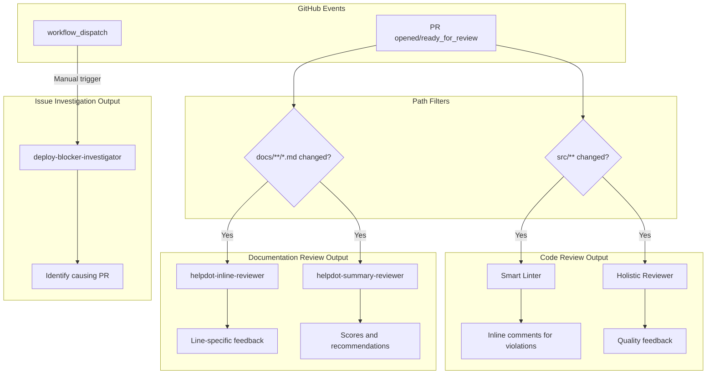

# AI Reviewer Philosophy
This philosophy guides our approach to AI-assisted code and documentation review, explaining when to use each reviewer and how to respond to their feedback.

#### Terminology
- **AI Reviewer** - Automated agent that analyzes PRs or issues and provides feedback
- **Holistic Reviewer** - A reviewer without predefined rules that provides general feedback
- **Smart Linter** - The code-inline-reviewer; a rule-based reviewer with predefined patterns
- **Rule Violation** - Specific pattern that triggers rule-based reviewer feedback

## Why We Use AI Reviewers

AI reviewers serve several key purposes in our development workflow:

### Scale human reviewer capacity
With a high volume of PRs, human reviewers can't catch every detail. AI reviewers provide consistent, automated first-pass review that catches common issues before human review, allowing human reviewers to focus on architectural decisions, business logic, and nuanced feedback.

### Enforce institutional knowledge consistently
Performance patterns, coding standards, and documentation guidelines are often tribal knowledge. AI reviewers codify this knowledge into repeatable checks, ensuring every PR benefits from the same expertise regardless of which human reviewer is assigned.

### Reduce review turnaround time
Contributors get immediate feedback on common issues without waiting for human reviewer availability. This enables faster iteration cycles and reduces the back-and-forth that slows down PR merges.

### Maintain quality at scale
As the codebase and contributor base grow, AI reviewers help maintain consistent quality standards without linearly increasing human reviewer burden.

## Guiding Principles

These are recommendations for working effectively with AI reviewers, not strict requirements.

### Treat AI feedback as suggestions
AI reviewers provide automated feedback to assist human reviewers, but their output is not infallible. Contributors and reviewers should evaluate each piece of feedback on its merits rather than blindly accepting or rejecting it.

### Discuss on vague feedback
When AI feedback is unclear or ambiguous, contributors will benefit from discussing it first with C+ reviewers before jumping to implementation. As mentioned in the first principle, reviewer feedback should be treated as suggestions only.

### Report false positives to maintainers
When AI feedback is incorrect or not applicable, reach out to the AI reviewer maintainers in the #expensify-open-source Slack channel to help improve the system. This feedback helps refine the reviewers and prevents the same issues from recurring.

### Keep rule documentation in sync with AI reviewer prompts
When adding or modifying rules in AI reviewer agent files, the corresponding documentation should be updated. The agent files in `.claude/agents/` are the source of truth for specific rules.

## Reviewer Setup

### Available AI Reviewers

**code-inline-reviewer (Smart Linter)**
- Reviews source code PRs for specific, predefined violations
- Creates inline comments on lines that violate rules
- See `.claude/agents/code-inline-reviewer.md` for current rule definitions

**Holistic Reviewer**
- Provides general code review without predefined rules
- Catches issues that don't fit into specific rule categories
- Acts as a counterweight to the Smart Linter
- Outputs general code quality feedback and suggestions
- Currently implemented using Codex, configured at the repository level

**helpdot-inline-reviewer**
- Reviews HelpDot documentation PRs for readability, AI readiness, and style compliance
- Creates inline comments for specific violations
- See `.claude/agents/helpdot-inline-reviewer.md` for criteria

**helpdot-summary-reviewer**
- Provides overall quality assessment with scoring for documentation PRs
- Posts a top-level PR comment with summary and recommendations
- See `.claude/agents/helpdot-summary-reviewer.md` for scoring criteria

**deploy-blocker-investigator**
- Investigates deploy blocker issues to identify the causing PR
- Posts findings and recommendations on the issue
- See `.claude/agents/deploy-blocker-investigator.md` for investigation process

### Triggers and When Reviewers Run

AI reviewers are triggered automatically based on contribution type and file changes. The diagram below shows the reviewer pipeline:

#### Code PRs

**Trigger conditions:**
- PR is opened or marked ready for review
- PR modifies files in `src/**`
- PR is not a draft
- PR title does not contain "Revert"

**How to re-run it?** Convert your PR to draft, then mark it ready for review again.

Code PRs benefit from the **two-reviewer approach**:

1. **Smart Linter (code-inline-reviewer)**: Catches specific, well-defined anti-patterns with consistent, rule-based feedback
2. **Holistic Reviewer**: Catches general code quality issues, design concerns, and anything not covered by specific rules

Together they balance precision (rules) with coverage (holistic review).

#### Documentation PRs

**Trigger conditions:**
- PR is opened or marked ready for review
- PR modifies files in `docs/**/*.md` or `docs/**/*.csv`
- PR is not a draft
- PR title does not contain "Revert"

**How to re-run it?** Convert your PR to draft, then mark it ready for review again.

Documentation PRs in the HelpDot system use two complementary reviewers:

1. **helpdot-inline-reviewer**: Line-specific feedback on violations
2. **helpdot-summary-reviewer**: Overall quality assessment with scores

#### Deploy Blocker Issues

**Trigger conditions:**
- Manually triggered via `workflow_dispatch`
- Issue must have the `DeployBlockerCash` label
- Actor must have write access to the repository

**How to re-run it?** Navigate to Actions → "Investigate Deploy Blocker" workflow → Run workflow with the issue URL.

When a deploy blocker issue needs investigation:

1. **deploy-blocker-investigator**: Analyzes the issue, identifies the likely causing PR, and recommends resolution

## Working with AI Feedback

### Addressing Valid Feedback
When AI feedback is accurate:
1. Make the suggested changes
2. If the fix differs from the suggestion, explain your approach

### Handling False Positives
When AI feedback is incorrect or not applicable:
1. Evaluate whether the feedback applies to your specific context
2. Reach out to AI reviewer maintainers in the #expensify-open-source Slack channel
3. Your feedback helps refine the reviewers and prevent recurring issues

### Escalating to Human Reviewers
Escalate to human reviewers when:
- You're unsure whether AI feedback is valid
- The AI feedback conflicts with other requirements
- The suggested fix would require significant architectural changes

### Examples

#### Appropriate Response to Valid Feedback
**AI Comment**: "PERF-1: Spread operator used on object in renderItem creates new object references on each render."

✅ **Good Response**: Pass individual props directly instead of using spread operator, or move object creation outside renderItem.

❌ **Bad Response**: Ignore the feedback without consideration.

#### Appropriate Response to False Positive
**AI Comment**: "PERF-11: Add a selector to `useOnyx` to select only the `name` and `avatar` fields instead of the entire user object."

**Context**: A selector is already present in the code - the AI reviewer missed it during analysis.

✅ **Good Response**: Reach out in the #expensify-open-source Slack channel explaining that a selector is already being used.

❌ **Bad Response**: Add a duplicate selector or ignore the feedback without verifying the claim.
