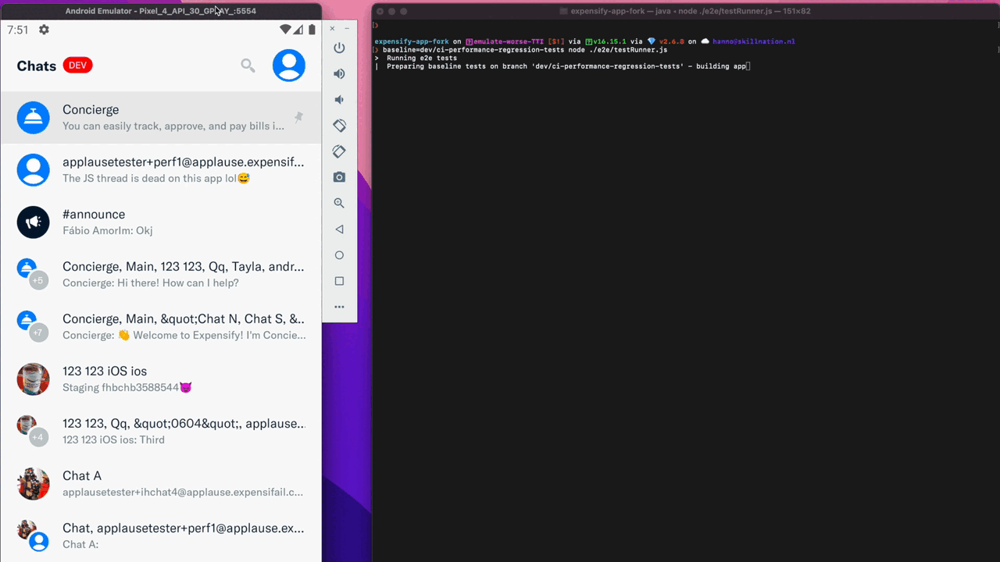

# E2E performance regression tests

This directory contains the scripts and configuration files for running the
performance regression tests. These tests are called E2E tests, because they
run the app on a real device (physical or emulated).

;

To run the e2e tests:

 1. Connect an android device. The tests are currently designed to run only on android. It can be
    a physical device or an emulator.

 2. Make sure fastlane was initialized by running `bundle install` 

 3. Run the tests with `npm run test:e2e`. 

## Structure

For the test suite no additional tooling was used. It is made of the following
components:

- Test server:
  - A nodeJS application that starts a WebSocket server.
  - Responsible for the communication between the test script and the app.
  - Located in `e2e/server`.

- Client:
  - Client-side code (app) needed for communication with the test server.
  - Execute commands received by the server and sends back the results.
  - Provides separate entry point for react native application.
  - Located in `src/libs/e2e`.

- The tests themselves and their utilities:
  - The file with the test procedure, using commands of the test server.
  - Utilities for helping with execution of the test, measuring and comparing results.
  - Located in `e2e/tests` (and accompanying directories).

### Server Client communication

The communication between the test server and the app is done via a WebSocket.

For every command send from the server to the client, the client is expected to respond.

The server's commands API will return promises, which will resolve (or reject) based on the 
clients' response (or reject due to a timeout). Thus, you can write your tests in a procedural
manner.

### A test structure

To execute certain actions within the app, the test script sends commands using the test server to the client.

Therefor, it first creates and starts a server instance. On this instance it can now call methods, which represent
the commands:

```js
const createAndStartServer = require('./e2e/server');

createAndStartServer().then((server) => {
    // the server is now running
    server.waitForAppReady().then(() => {
        // ... run some tests
        
        // ... and in the end stop the server
        server.stopServer();
    })
})
```

It is important to stop the server instance after your test is done. Each test starts their own
test server instance, which also implies that the tests will run "in order" and not parallel.

The main entry for the test suite is `e2e/testRunner.js`. After you created a test you need to add it
in the `TESTS` array.

## Adding new commands

Commands are actions that will run on the client. Note that we **don't** interact on a UI level, doing stuff like
`element(by.text('Login')).tap();`. A command is javascript code that runs directly inside the app, so you'd do stuff
like `navigationRef.navigate('Login')` etc.

To add a new command:

1. Create a new command name in `e2e/server/commands.js`:
```js
module.exports = {
  LOGIN: 'login',
  MY_NEW_COMMAND: 'myNewCommand',
  // ...
```

2. The client will receive a command with this name. Now we need to tell the client what to do with it. In `src/libs/e2e/client.js`:
add handling for the command. There is a switch statement, in which you can add your case
```js
// ...
const command = JSON.parse(commandStr);
const commandType = command.type;
switch (commandType) {
  case Commands.LOGIN:
    // ...
    break;
  case Commands.MY_NEW_COMMAND: {
    // Execute some logic here, or add it as a new file 
    // in `src/libs/E2E/appCommands/myNewCommand.js` and call it here
    break;
  }
}
```

3. Send a status back to the server. This is important, so the server know whether you command succeeded. Either use the
prebuilt `sendStatus` method, or implement your own response logic:
```js
case Commands.MY_NEW_COMMAND: {
  // ...
  sendStatus(commandType, 'success');
  // or maybe you need to send some custom data back:
  sendData({
    type: 'myCustomResponseType',
    customData: {
        duration: 1231,
    }
  });
}
```

## Run a single test

You might don't want to execute the whole suite when developing a new test. For that, you can just manually call your test:

```bash
node ./e2e/tests/MyNewTest.e2e.js
```

Note: if you customized client/app code, you need to recompile the app, as it's a release app that has the app code
pre-bundled:

```bash
# make sure fastlane is installed, you only need to run the following command once:
bundle install

npm run android-build-e2e
```

## Android specifics

The tests are designed to run on android (although adding support for iOS should be easy to add).
To test under realistic conditions during the tests a release build is used.

However, to enable the WebSocket communication to our local WebSocket server, we need to allow
[cleartext http traffic](https://developer.android.com/training/articles/security-config#CleartextTrafficPermitted).
Therefor, a customized release build type is needed, which is called `e2eRelease`. This build type has clear
text traffic enabled, but works otherwise just like a release build.

For the app to detect that it is currently running e2e tests, a environment variable called `E2E_TESTING=true` must
be set. There is a custom environment file in `e2e/.env.e2e` that contains the env setup needed. The build automatically
picks this file for configuration.
