Here's a test mermaid chart for our implementation (FIXED - newlines now preserved):

```mermaid
graph TD
    A[Send Message] --> B{Mermaid Detected?}
    B -->|Yes| C[Parse Code Block]
    C --> D[Generate Chart]
    D --> E[Display in Chat]
    B -->|No| F[Show as Code]
    E --> G[Success! 🎉]
    
    style A fill:#e1f5fe
    style G fill:#c8e6c9
    style E fill:#fff3e0
```

## ✅ Fix Applied:
- **Problem**: Newlines were being stripped from mermaid chart content during HTML attribute escaping
- **Solution**: Encode newlines as `__MERMAID_NEWLINE__` during parsing, decode back to `\n` in renderers
- **Result**: Mermaid syntax now parses correctly with proper line breaks

## 🎯 Testing Instructions:
1. Copy this entire message
2. Paste it into a chat conversation
3. The chart should render as an interactive diagram (not show parsing errors)
4. Test on both web and mobile if possible

## 🔧 Technical Details:
- **Web**: Direct DOM manipulation with Mermaid.js + zoom controls
- **Mobile**: WebView rendering with pinch-to-zoom support
- **Cross-platform**: Platform-specific renderers for optimal performance 